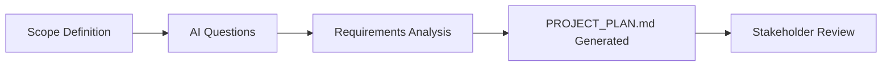
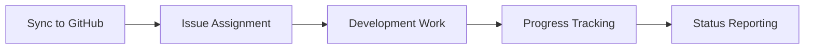
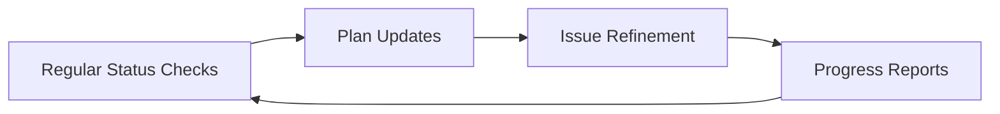

# AWS Infrastructure Project Planning Template

**A comprehensive template for managing client AWS infrastructure projects with automated GitHub integration**

This repository provides a structured approach to planning, tracking, and executing AWS infrastructure projects for clients. It includes automated GitHub issue management, comprehensive project templates, and AI-assisted planning tools.

## ✨ Template Features

- **🏗️ Comprehensive AWS Planning**: Pre-built templates for common AWS architectures
- **📋 Automated Issue Tracking**: Convert project plans into GitHub issues automatically
- **🤖 AI-Powered Planning**: Built-in Claude Code integration for intelligent project assistance
- **📊 Progress Monitoring**: Real-time status tracking and progress reporting
- **🔄 Client-Ready Structure**: Professional templates suitable for client delivery
- **📚 Knowledge Management**: Organized documentation and decision tracking

## 🚀 Quick Start for New Client Projects

### Step 1: Create New Project Repository

1. Click **"Use this template"** button on GitHub
2. Create repository: `[client-name]`
3. Clone to your local machine:
   ```bash
   git clone https://github.com/[your-org]/[client-name].git
   cd [client-name]
   ```

### Step 2: Initialize Project Planning

1. **Start the planning process:**

   ```bash
   /project-plan [your project scope description]
   ```

2. **Example usage:**

   ```bash
   /project-plan Deploy scalable e-commerce platform on AWS with high availability, supporting 10k concurrent users, using containerized architecture with RDS database and CloudFront CDN
   ```

3. **The system will:**
   - Ask clarifying questions about your requirements
   - Generate a comprehensive `PROJECT_PLAN.md` file
   - Create structured phases and tasks
   - Provide architectural recommendations

### Step 3: Sync with GitHub Issues

1. **Create GitHub issues from your plan:**

   ```bash
   /project-plan sync
   ```

2. **This automatically:**
   - Creates individual GitHub issues for each task
   - Links to project board: https://github.com/orgs/itsacloudlife/projects/5
   - Adds appropriate labels and milestones
   - Updates your PROJECT_PLAN.md with issue numbers

### Step 4: Monitor Progress

1. **Check project status anytime:**

   ```bash
   /project-plan status
   ```

2. **View detailed progress including:**
   - Overall completion percentage
   - Progress by phase
   - Blocked or at-risk items
   - Team performance metrics

## 🛠️ Available Commands

### `/project-plan` - Main Planning Command

| Usage                   | Description                                    |
| ----------------------- | ---------------------------------------------- |
| `/project-plan [scope]` | Create new project plan from scope description |
| `/project-plan update`  | Modify existing project plan                   |
| `/project-plan sync`    | Sync plan tasks to GitHub issues               |
| `/project-plan status`  | Check project progress and status              |

#### Detailed Command Examples:

```bash
# Create a new project plan
/project-plan Build microservices architecture on AWS with API Gateway, Lambda functions, DynamoDB, and CI/CD pipeline for fintech application

# Update an existing plan
/project-plan update

# Sync all tasks to GitHub issues (run after plan creation/updates)
/project-plan sync

# Check current project status and progress
/project-plan status
```

## 📁 Repository Structure

```
.
├── .claude/                    # AI assistant configuration
│   ├── CLAUDE.md              # Project-specific AI context
│   ├── agents/                # Specialized AI agents
│   │   └── issue-manager.md   # GitHub issue management agent
│   └── commands/              # Custom Claude Code commands
│       └── project-plan.md    # Project planning command
├── .github/                   # GitHub configuration
│   ├── ISSUE_TEMPLATE/        # Issue templates
│   └── pull_request_template.md
├── diagrams/                  # Architecture diagrams
│   └── [project-name]/        # Project-specific diagrams
├── notes/                     # Project documentation
│   ├── decisions/             # Architecture decision records
│   ├── meetings/              # Meeting notes and minutes
│   └── research/              # Research and analysis
├── proposals/                 # Project proposals and RFCs
├── PROJECT_PLAN.md           # Main project plan (generated)
└── README.md                 # This file
```

## 📋 Project Planning Workflow

### 1. Initial Planning Phase



### 2. Execution Phase



### 3. Ongoing Management



## 🎯 Project Plan Structure

Each generated `PROJECT_PLAN.md` includes:

### Essential Sections:

- **Overview**: Project goals and business objectives
- **AWS Architecture**: Required services and design decisions
- **Implementation Phases**: Structured 4-phase approach
- **Timeline & Milestones**: Clear delivery schedule
- **Risk Assessment**: Identified risks and mitigation strategies
- **Budget Estimation**: Cost projections by environment
- **Security Considerations**: Comprehensive security checklist
- **Team & Responsibilities**: RACI matrix and role definitions

### Automated Sections:

- **GitHub Issue Tracking**: Real-time sync status
- **Progress Monitoring**: Completion percentages by phase
- **Change Log**: Automatic tracking of plan modifications

## 🔄 GitHub Integration Features

### Automated Issue Management

- **Smart Issue Creation**: Each task becomes a tracked GitHub issue
- **Automatic Labeling**: Issues tagged by phase, priority, and component
- **Project Board Integration**: Connected to https://github.com/orgs/itsacloudlife/projects/5
- **Progress Tracking**: Real-time status updates in PROJECT_PLAN.md

### Issue Lifecycle

1. **Created**: Task identified in project plan
2. **Assigned**: Team member takes ownership
3. **In Progress**: Work begins, tracked in GitHub
4. **Review**: Pull request created for changes
5. **Completed**: Issue closed, plan updated automatically

## 📊 Monitoring and Reporting

### Real-time Status Dashboard

The `/project-plan status` command provides:

```
📊 PROJECT STATUS: Client AWS Infrastructure

Overall Progress: 45% (18/40 tasks completed)

Phase Breakdown:
├── Phase 1: Foundation        ████████████ 100% (8/8)
├── Phase 2: Core Infrastructure ██████░░░░ 60% (6/10)
├── Phase 3: Operations        ███░░░░░░░   30% (3/10)
└── Phase 4: Security          ░░░░░░░░░░   0% (0/12)

🚨 Blockers: 2 issues need attention
⚠️  At Risk: 1 issue behind schedule
✅ On Track: 15 issues progressing normally
```

### Automated Reports

- **Daily Standup Reports**: Progress since last update
- **Weekly Status Reports**: Comprehensive progress analysis
- **Milestone Reports**: Phase completion and next steps
- **Risk Reports**: Identification of potential delays or issues

## 🏗️ Common AWS Architecture Patterns

The template supports these pre-configured patterns:

### 1. **Web Application Stack**

- VPC with public/private subnets
- Application Load Balancer
- Auto Scaling Groups
- RDS with Multi-AZ
- CloudFront + S3

### 2. **Microservices Architecture**

- ECS/EKS container orchestration
- API Gateway + Lambda
- DynamoDB + ElastiCache
- Service mesh configuration
- CI/CD pipelines

### 3. **Data Processing Pipeline**

- S3 data lake architecture
- Lambda data processing
- Kinesis streaming
- EMR analytics
- QuickSight dashboards

### 4. **Serverless Application**

- Lambda function architecture
- API Gateway routing
- DynamoDB data layer
- Cognito authentication
- CloudFormation IaC

## 🛡️ Security and Compliance

### Built-in Security Checklist

- Network security configuration
- IAM roles and policies
- Encryption at rest and in transit
- Monitoring and logging setup
- Compliance framework alignment

### Compliance Support

- **SOC 2**: Security controls and monitoring
- **HIPAA**: Healthcare data protection
- **PCI DSS**: Payment card security
- **GDPR**: EU data protection requirements

## 💰 Cost Management

### Automated Cost Estimation

- Service-by-service cost breakdown
- Environment-based pricing
- Monthly and annual projections
- Cost optimization recommendations

### Cost Monitoring

- Budget alerts and thresholds
- Resource utilization tracking
- Right-sizing recommendations
- Reserved instance analysis

## 👥 Team Collaboration

### Role-Based Access

- **Project Manager**: Full plan access and reporting
- **Solution Architect**: Architecture decisions and reviews
- **DevOps Engineer**: Implementation task management
- **Security Engineer**: Security validation and compliance
- **Client Stakeholder**: Read-only progress access

### Communication Features

- **Slack Integration**: Status updates to team channels
- **Email Reports**: Weekly progress summaries
- **GitHub Notifications**: Real-time issue updates
- **Client Portals**: Stakeholder-friendly progress views

## 🔧 Customization Guide

### For Your Organization

1. **Update GitHub Organization**: Replace `itsacloudlife` with your org name
2. **Customize Project Board**: Update project board URL in templates
3. **Add Company Branding**: Update templates with your company information
4. **Configure Integrations**: Set up Slack, email, or other notification systems

### For Specific Clients

1. **Client Information**: Update contact details and stakeholder info
2. **Compliance Requirements**: Add client-specific compliance needs
3. **Budget Constraints**: Configure appropriate cost thresholds
4. **Timeline Adjustments**: Modify phase durations based on client needs

## 🚀 Getting Started Checklist

### Repository Setup

- [ ] Use this template to create new client repository
- [ ] Update repository name and description
- [ ] Configure GitHub project board access
- [ ] Set up team member permissions

### Initial Configuration

- [ ] Update `.claude/CLAUDE.md` with client-specific context
- [ ] Customize issue templates in `.github/ISSUE_TEMPLATE/`
- [ ] Configure notification preferences
- [ ] Set up local development environment

### First Project Plan

- [ ] Run `/project-plan [scope]` with client requirements
- [ ] Review and refine generated plan
- [ ] Execute `/project-plan sync` to create GitHub issues
- [ ] Assign initial tasks to team members

### Ongoing Management

- [ ] Schedule regular `/project-plan status` checks
- [ ] Update plans as requirements evolve
- [ ] Monitor GitHub project board progress
- [ ] Generate client status reports

## 📚 Additional Resources

### Documentation

- [AWS Well-Architected Framework](https://aws.amazon.com/architecture/well-architected/)
- [GitHub Project Management](https://docs.github.com/en/issues/planning-and-tracking-with-projects)
- [Claude Code Documentation](https://docs.claude.com/en/docs/claude-code)

### Training Materials

- AWS Solution Architecture patterns
- Project management best practices
- GitHub integration workflows
- Client communication templates

### Support

- Technical issues: Create GitHub issue in this repository
- Feature requests: Use GitHub Discussions
- Urgent support: Contact project maintainers

## 🤝 Contributing

We welcome contributions to improve this template! Please:

1. Fork the repository
2. Create feature branch (`git checkout -b feature/amazing-feature`)
3. Commit changes (`git commit -m 'Add amazing feature'`)
4. Push to branch (`git push origin feature/amazing-feature`)
5. Open Pull Request

### Contribution Areas

- New AWS architecture patterns
- Enhanced automation features
- Additional reporting capabilities
- Client communication improvements
- Cost optimization tools

## 📄 License

This project is licensed under the MIT License - see the [LICENSE](LICENSE) file for details.

## 📞 Support

- **Repository**: https://github.com/[your-org]/aws-infrastructure-template
- **Issues**: Report bugs and request features
- **Discussions**: Community support and ideas
- **Documentation**: Comprehensive guides and examples

---

<div align="center">
<strong>Transform your AWS infrastructure projects with structured planning and automated tracking.</strong><br>
Built with ❤️ for professional services teams
</div>
